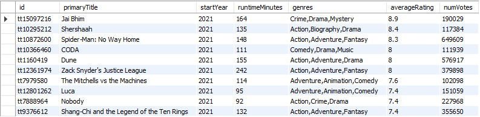
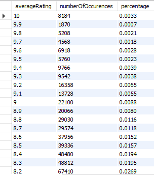

# IMDbMovies
Takes various datasets provided by ['IMDb'](https://www.imdb.com/interfaces/) and imports them into SQL tables, performing a series of queries on them regarding movies and ratings.

### How To Use
Please download the following tsv files from ['IMDb'](https://www.imdb.com/interfaces/):
- title.basics.tsv.gz
- title.ratings.tsv.gz

and unzip them into the proper folder, then update the file paths appropriately when reading the data into the tables:  

### Example Outputs
Below are some examples of queries and their outputs.
- The most popular movies from 2021 (where movies must have passed a minimum threshold of 100,000 votes to be included):  

- Frequency of each rating (i.e., 0.33% of content on IMDb has a 10 star rating:   

